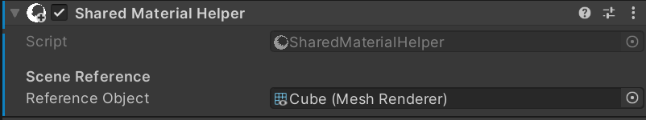

# Shared Material Helper

Simple component to help sync materials across instances so you can animate one (for example, on Timeline) and the rest will follow in sync

# Setup
Add to your project (see the readme) via git or OpenUPM

## Basic workflow

1. Add the 'Shared Material Helper' component to the objects you wish to stay in sync 
2. Add a reference to the parent / reference object in the component's 'Reference Object' 

That's it! What you do to the parent object's material will be reflected in the child / instance materials!
