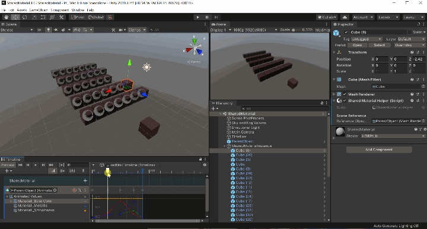

# com.pixelwizards.shared-material
=========================

[](https://openupm.com/packages/com.pixelwizards.shared-material/)

## About this Project

Simple Shared Material Helper

Add the component via:

- Add ***Component->Shared Material->Shared Material Helper***, or 
- Add ***Component->Shared Material->Shared Material Group Helper***


Both components are the same, with one exception:

**Shared Material Helper**

- operates on a single object (renderer) - you can drive the material animation for a single instance with this component (as part of a prefab for example)

**Shared Material Group Helper**

- operates on a list of nested / child objects (renderers) - so you can drive the material animation for an entire group of instances by simply adding this component to a parent GameObject

## Example

Here it is with a single object animated on timeline - all of the instances sync to the animation!



## Installation

### Install via OpenUPM

The package is available on the [openupm registry](https://openupm.com). It's recommended to install it via [openupm-cli](https://github.com/openupm/openupm-cli).

```
openupm add com.pixelwizards.shared-material
```

### Install via git URL

To install this package, you need to edit your Unity project's `Packages/manifest.json` and add this repository as a dependency. You can also specify the commit hash or tag like this:

```json
{
  "dependencies": {
    "com.pixelwizards.shared-material": "https://github.com/PixelWizards/com.pixelwizards.shared-material.git",
   }
}
```

## Prerequistes
---------------
* This has been tested for `>= 2018.3`

## Content
----------------

### Tools

* Component/Shared Material/Shared Material Helper
* Component/Shared Material/Shared Material Group Helper

### Required dependencies
---------------
* None 
